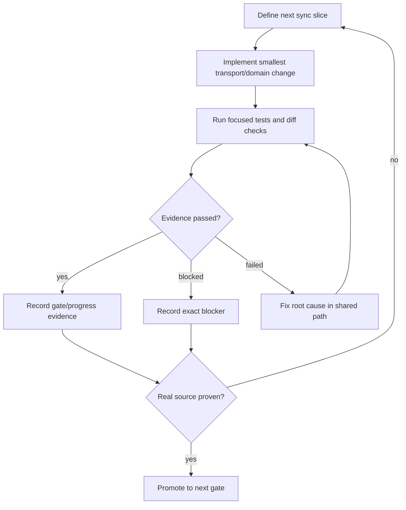

# Sync infrastructure loop

Purpose: keep Bluetooth sync work moving through a small evidence loop until real watch data is either proven or formally blocked.

Current node: controlled BLE central reader, peripheral harness, and Android coordinator wiring exist; physical loopback evidence is still blocked by desktop/device execution.

## Active graph

| Node | Status | Evidence |
| --- | --- | --- |
| Source seam | Done | `WorkoutSourceReader`, synthetic default, Bluetooth source adapter |
| Payload parser | Done | `BluetoothWorkoutSummaryCodec` |
| Preflight | Done | adapter/enabled/permission/pairing checks |
| Central scan/connect/read | Done in code | `AndroidBleWorkoutPayloadReader` |
| Peripheral loopback | Done in code | `AndroidBleWorkoutLoopbackPeripheral`; needs two-device execution |
| Android wiring | Done in code | `AndroidBluetoothSyncWiring` |
| Three-transfer dedupe | Covered at coordinator level | controlled Bluetooth source test path |
| Real Huawei source | Blocked | needs official/documented source path |
